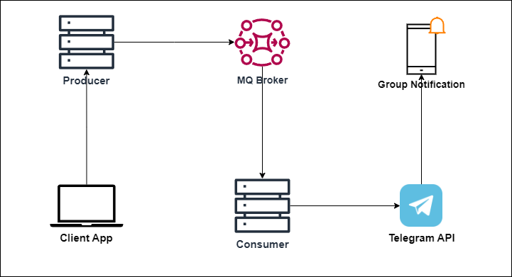

# Group Meeting Notification Application for Telegram using Java Spring Boot

This application enables the creation and management of group meeting notifications on Telegram through a Telegram Bot. It employs a producer and consumer-style and incorporates REST endpoints for convenient CRUD operations. The application is built with Java Spring Boot and utilizes a scheduler for sending reminders in the morning and before the start of the meeting. The meeting information can be managed solely via the provided REST API, and the Telegram Bot functions solely as a consumer for notifications without receiving any input.

  

## Features

- Effortless creation of group meeting notifications on Telegram
- Integration with a Telegram Bot for efficient notification delivery
- Implementation of the producer and consumer architecture for optimized message handling
- Scheduler for sending morning reminders and meeting start notifications

## Installation

1. Clone the repository: `git clone https://github.com/hakimfauzi23/group-telegram-meeting-reminder.git`
2. Navigate to the project directory: `cd group-telegram-meeting-reminder`
3. Config application.properties (if you don't have a telegram bot, please read [Telegram API Docs](https://core.telegram.org/bots/api) )
4. Create the database (the table will be automatically created if the properties is set `spring.jpa.hibernate.ddl-auto=update`)
5. Start a rabbitMQ Application, here's my command for starting RabbitMQ on docker : `docker run --rm -it -p 15672:15672 -p 5672:5672 rabbitmq:3.10.5-management`
6. Build the application: `mvn clean install`
7. Run the application: `java -jar target/group-reminder-bot-0.1.0.jar`

## Configuration

1. Create a Telegram Bot through the BotFather on Telegram.
2. Obtain the API token for the created bot.
3. Configure the application with the obtained API token and other necessary properties.

## Usage

- **Creating Group Meeting Notifications:** Utilize the provided REST endpoints to create meeting notifications for specific Telegram groups.
- **Managing Meeting Notifications:** Utilize the exposed CRUD operations to manage existing meeting notifications effectively.
- **Interacting with the Scheduler:** Utilize the scheduler to send morning reminders and meeting start notifications.

## API Endpoints

- `POST /api/messages` - Create a new meeting notification.
- `GET /api/messages` - Retrieve all meeting notification.
- `GET /api/messages/today` - Retrieve all meeting notification that held today.
- `PUT /api/messages/{id}` - Update a specific meeting notification.
- `DELETE /api/messages/{id}` - Delete a specific meeting notification.

## Dependencies

- [Java Development Kit (JDK)](https://www.oracle.com/java/technologies/javase-jdk11-downloads.html) - Required for running the application.
- [Spring Boot](https://spring.io/projects/spring-boot) - Framework for creating stand-alone, production-grade Spring-based applications.
- [Telegram Bot API](https://core.telegram.org/bots/api) - Telegram Bot API for sending messages.
- [Spring Web](https://spring.io/guides/gs/spring-boot/) - Spring framework for building web applications.
- [RabbitMQ](https://www.rabbitmq.com/) - RabbitMQ Message broker for producer and consumer style in sending telegram notification

## Contributing

Contributions are welcome! If you encounter any issues or have suggestions for improvements, please feel free to open an issue or submit a pull request.

## License

This project is licensed under the [MIT License](https://opensource.org/licenses/MIT) - see the [LICENSE.md](LICENSE.md) file for details.
